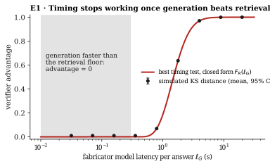

# E1 · Timing

**Tests** [Proposition 1](../../1-theory/#proposition-1--timing-gives-no-signal-once-generation-beats-retrieval):
the best test that sees only response times has advantage $F_R(\ell_G)$, which is 0 once the
fabricator's model is faster than the retrieval floor $\ell_{\min} = 0.3$ s.

**Method.** For 9 fabricator latencies $\ell_G$ from 0.03 s to 20 s, draw 20,000 padded
fabricator response times and 20,000 honest ones, and compute the two-sample
Kolmogorov–Smirnov distance. KS is a lower bound on total variation; for the padded fabricator
both equal $F_R(\ell_G)$. Repeat with 6 seeds.

| $\ell_G$ (s) | 0.03 | 0.16 | 0.35 | 0.79 | 1.78 | 3.98 | 8.91 |
|---|---|---|---|---|---|---|---|
| Closed form $F_R(\ell_G)$ | 0 | 0 | 0 | 0.070 | 0.636 | 0.969 | 1.000 |
| Simulated KS, mean ± 95% CI | 0.010 ± 0.003 | 0.010 ± 0.003 | 0.010 ± 0.003 | 0.069 ± 0.001 | 0.637 ± 0.003 | 0.970 ± 0.001 | 0.999 ± 0.000 |

**Result.** The simulated distance matches the closed form within 0.010 at every latency. Below
the floor, the residual 0.010 is the sampling noise of two independent samples, below the KS
critical value of 0.014 at $\alpha = 0.05$: no test detects a difference.

Data: [`results.json`](results.json).
