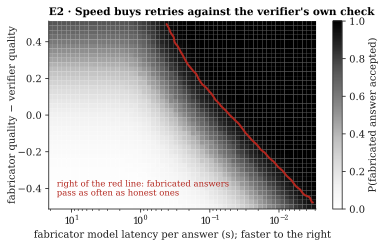

# E2 · Checking

**Tests** [Proposition 2](../../1-theory/#proposition-2--speed-buys-retries-against-the-verifiers-own-check):
a fabricator that spends an honest-looking delay on $n$ retries against the verifier's check
passes as often as an honest answer once $n \ge \ln\beta/\ln(1-p)$.

**Method.** Over a grid of 60 fabricator latencies (3 ms to 20 s) × 41 quality gaps (−0.5 to
+0.5), draw 300 honest-looking delays per cell, give the fabricator $n = \lfloor d/\ell_G \rfloor$
retries, and average the pass probability $1-(1-p)^n$ with $p$ from assumption A4. The red line
marks the honest pass rate $1-\beta = 0.95$. The largest Monte Carlo standard error of any cell
is 0.029.

| Quality gap (fabricator − verifier) | −0.2 | −0.1 | 0 | +0.1 | +0.2 |
|---|---|---|---|---|---|
| Retries to match the honest pass rate | 75 | 42 | 24 | 14 | 8 |

**Result.** At equal quality, one sample passes with $p = 0.12$, and 24 retries match an honest
answer. A weaker fabricator needs more retries, so more speed: quality and speed trade against
each other along the red line.

Data: [`results.json`](results.json).
