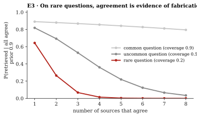

# E3 · Corroboration

**Tests** [Proposition 4](../../2-game-theory/#proposition-4--agreement-is-a-cheap-signal-so-it-pools):
when a fabricator can make $k$ sources agree for $k\,c_G \approx 0$, the posterior that the
answer was retrieved, $\pi a^k / (\pi a^k + 1 - \pi)$, falls with $k$.

**Method.** Closed form, prior $\pi = 0.9$, for coverage $a$ = 0.9 (common), 0.5 (uncommon) and
0.2 (rare). Deterministic, so no intervals.

| Sources that agree, $k$ | 1 | 2 | 3 | 4 | 8 |
|---|---|---|---|---|---|
| Common question ($a = 0.9$) | 0.89 | 0.88 | 0.87 | 0.86 | 0.79 |
| Uncommon ($a = 0.5$) | 0.82 | 0.69 | 0.53 | 0.36 | 0.03 |
| Rare ($a = 0.2$) | 0.64 | 0.26 | 0.07 | 0.01 | 0.00 |

**Result.** On a rare question, three agreeing sources drop the posterior from 0.64 to 0.07:
agreement is evidence of fabrication, because honest sources rarely all have a rare answer.

Data: [`results.json`](results.json).
