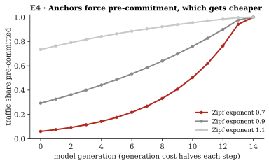

# E4 · Anchors

**Tests** [Proposition 5](../../2-game-theory/#proposition-5--pre-commitment-gets-cheaper):
when answers must carry a commitment older than the question, a fabricator must pre-commit, and
the traffic share it can pre-commit grows as generation gets cheaper.

**Method.** Closed form. Budget $B = 10^4$ answers at generation 0, cost halving each
generation, $N = 10^8$ distinct questions with Zipf popularity, for exponents 0.7, 0.9 and 1.1.
Deterministic, so no intervals.

| Generation | 0 | 4 | 8 | 12 |
|---|---|---|---|---|
| Zipf 0.7 | 0.06 | 0.14 | 0.33 | 0.76 |
| Zipf 0.9 | 0.29 | 0.44 | 0.64 | 0.90 |
| Zipf 1.1 | 0.73 | 0.84 | 0.92 | 0.98 |

**Result.** Anchors protect the long tail, and the tail shrinks. With Zipf exponent 0.9, the
traffic a fabricator can pre-commit rises from 29% to 90% over 12 generations.

Data: [`results.json`](results.json).
