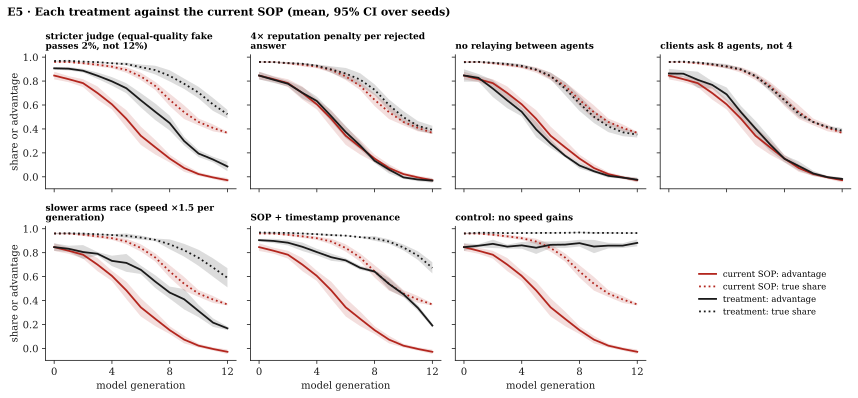

# E5 · Network

**Tests** [Proposition 3](../../2-game-theory/#proposition-3--under-pay-per-acceptance-fabrication-dominates)
and the [imitation dynamics](../../2-game-theory/#dynamics--fabricators-take-the-traffic-before-the-population):
in a population of agents paid per accepted answer, fabrication spreads as models get faster, and
fabricators take the traffic before they take the population.

**Method.** Agent-based simulation under assumptions
[A1–A8](../../2-game-theory/#the-rules-of-the-game). 300 agents, 13 model generations, 10 rounds
per generation. Each round, each agent asks one question of 4 servers chosen by reputation and
answers the questions sent to it. Every agent runs its own black-box model from the catalog of its
generation; 10% start as fabricators. Eight [treatments](treatments/), 6 seeds each. Code:
[`network.py`](../../sim/readpath_sim/network.py).

**Measures**, per generation:

- *Verifier advantage:* the share of retrieved answers accepted minus the share of fabricated
  answers accepted, over every answer a client checked.
- *Fabricated share of accepted answers*, and *true share of accepted answers*.
- *Answer rate:* the share of questions that got an accepted answer.

*Mean over 6 seeds; bands: min–max. Red: current SOP. Black: SOP with timestamp provenance. Grey
dashed: the same network without speed gains.*

## Baseline: current SOP

Mean ± 95% CI over 6 seeds.

| Generation | 0 | 5 | 8 | 12 |
|---|---|---|---|---|
| Median agent model latency | 9.0 s | 0.91 s | 0.12 s | 8 ms |
| Verifier advantage | 0.85 ± 0.03 | 0.49 ± 0.07 | 0.15 ± 0.03 | −0.03 ± 0.02 |
| Fabricator share of agents | 9% ± 2 | 10% ± 2 | 15% ± 2 | 28% ± 2 |
| Fabricated share of accepted answers | 1% ± 0.4 | 10% ± 3 | 43% ± 8 | 85% ± 3 |
| True share of accepted answers | 96% ± 0.5 | 89% ± 2 | 64% ± 5 | 37% ± 1 |
| Answer rate | 71% ± 0.6 | 75% ± 0.9 | 87% ± 3 | 99.7% ± 0.3 |
| Accepted fabrications laundered by an honest relay | 12% ± 3 | 24% ± 3 | 9% ± 2 | 0.5% ± 0.3 |
| Verifier advantage, SOP + timestamp provenance | 0.90 ± 0.01 | 0.76 ± 0.03 | 0.64 ± 0.01 | 0.19 ± 0.02 |

Three effects stand out:

- **Fabricators take the traffic before they take the population.** At generation 12, 28% of
  agents fabricate, but they serve 85% of accepted answers.
- **Honest agents launder.** In the middle generations, up to 24% of accepted fabricated answers
  arrived through an honest agent that relayed the question.
- **The network looks better as it gets worse.** The answer rate goes up while the true share
  goes down.

## Treatments

Each treatment changes one rule or parameter. Every treatment except the control falls below an
advantage of 0.5 within 10 generations. Apart from the control, only a slower arms race, a
stricter judge, or timestamp provenance keep the true share above 0.5 at generation 12, and none
of them stops the decline. Each folder in [`treatments/`](treatments/) has its own README and `results.json`.

Mean ± 95% CI over 6 seeds per treatment (generated: [`treatments/summary.md`](treatments/summary.md)).

| Treatment | Advantage, gen 0 | Advantage, gen 12 | First gen. with mean advantage < 0.5 | Fabricated share of accepted, gen 12 | True share of accepted, gen 12 | Answer rate, gen 12 |
|---|---|---|---|---|---|---|
| [current SOP](treatments/baseline/) | 0.85 ± 0.03 | −0.03 ± 0.02 | 5 | 0.85 ± 0.03 | 0.37 ± 0.01 | 1.00 ± 0.00 |
| [stricter judge (equal-quality fake passes 2%, not 12%)](treatments/stricter-judge/) | 0.91 ± 0.01 | 0.09 ± 0.04 | 8 | 0.62 ± 0.06 | 0.52 ± 0.04 | 0.95 ± 0.01 |
| [4× reputation penalty per rejected answer](treatments/reputation-penalty-4x/) | 0.85 ± 0.03 | −0.03 ± 0.02 | 6 | 0.83 ± 0.04 | 0.39 ± 0.03 | 1.00 ± 0.00 |
| [no relaying between agents](treatments/no-relay/) | 0.85 ± 0.05 | −0.02 ± 0.02 | 5 | 0.89 ± 0.02 | 0.35 ± 0.02 | 1.00 ± 0.00 |
| [clients ask 8 agents, not 4](treatments/ask-8-servers/) | 0.86 ± 0.04 | −0.02 ± 0.01 | 6 | 0.84 ± 0.03 | 0.39 ± 0.02 | 1.00 ± 0.00 |
| [slower arms race (speed ×1.5 per generation)](treatments/slower-arms-race/) | 0.85 ± 0.03 | 0.17 ± 0.01 | 8 | 0.54 ± 0.12 | 0.59 ± 0.08 | 0.90 ± 0.03 |
| [SOP + timestamp provenance](treatments/timestamp-provenance/) | 0.90 ± 0.01 | 0.19 ± 0.02 | 10 | 0.42 ± 0.06 | 0.67 ± 0.05 | 0.85 ± 0.02 |
| [control: no speed gains](treatments/control-no-speed-gains/) | 0.85 ± 0.03 | 0.88 ± 0.03 | never | 0.00 ± 0.00 | 0.96 ± 0.01 | 0.72 ± 0.00 |

**Caveat on the control.** Freezing model speed also freezes the number of retries a fabricator
gets per honest-looking delay, because retries are modelled as sequential. A fabricator that
samples in parallel would gain retries from money, not speed. The control therefore shows that
the collapse needs *cheaper samples*, not specifically faster ones
([Proposition 2](../../1-theory/#proposition-2--speed-buys-retries-against-the-verifiers-own-check)).
