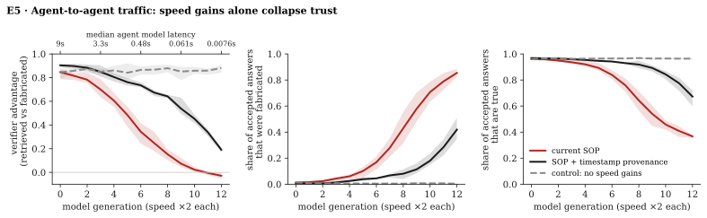

# Fast models make tool output unverifiable

*A theoretical study of agent-to-agent traffic · Readpath · October 2026*

> **TL;DR.** Agents ask MCP servers questions. **Can a client tell whether a server's answer
> existed before the question, or was generated when the question arrived?** With query access
> alone, it cannot. A server that generates each answer on first request and stores it is
> indistinguishable from one whose whole state was fixed in advance, however many queries the
> client makes (Theorem 1). A check that is made only of model reasoning can be run by the server
> first, so it adds nothing (Theorem 2). Timing was the one signal left, and faster models remove
> it. Only private information or a commitment published before the question helps, and a
> commitment proves only *when* content existed, not that it is true (Theorem 3). MCP has no
> mechanism for a server to commit to its state. In a simulated network of 300 agents, the
> verifier's advantage falls from 0.85 to 0 over ten doublings of model speed, and the true share
> of accepted answers falls from 96% to 37%.
>
> **Every number in this repository is illustrative, not measured.** The results hold inside
> a stated model; the assumptions are listed, and so is what would change our mind.

<sub>Status: the earlier fabricator prototype is discontinued and preserved on branch
[`parked/jit-harness`](https://github.com/LaumerLoma/readpath/tree/parked/jit-harness). This
branch holds the study. The servers in `jit/` and `probe/` are kept only as sample code for the
black boxes.</sub>

## How this repository is organized

The study is read in three parts, from the most general claim to the most specific one.

| Part | Point of view | Holds for |
|---|---|---|
| [1 · Theory](1-theory/) | Theoretical computer science: what a client can and cannot verify with query access. Theorems 1–3, Propositions 1–2, Corollary 1. | Every verifier and every server. No parameters. |
| [2 · Game theory](2-game-theory/) | What servers choose to do once checking cannot separate them, and which rules change that choice. Propositions 3–6, imitation dynamics. | The stated model of the market (SOP, assumptions A1–A8). |
| [3 · Experiments](3-experiments/) | Numerical checks and simulations, one folder each, with seeds and confidence intervals. E1–E5, eight treatments. | Illustrative parameters. |

## Key findings

**Theory** ([1](1-theory/)), for every verifier and every server:

- **Query access cannot show that a state existed before the question** (Theorem 1). Checking
  the whole server only forces a lazy server to generate the whole state.
- **A known check can be passed by search** (Theorem 2). Retrieval authenticity has no witness
  that a verifier can check, so soundness needs a secret or a trusted party.
- **Commitments enforce "existed before", and nothing more** (Theorem 3).
- **Timing gives no signal once generation beats retrieval** (Proposition 1), and speed buys
  retries against the verifier's check (Proposition 2).
- **Trust reduces to selection** (Corollary 1). When checking cannot separate the two servers,
  an accepted answer is worth exactly what the mechanism that picked the server is worth. Under
  open ranking, that is search engine optimization.

**Game theory** ([2](2-game-theory/)), in the stated model:

- **Under pay-per-acceptance, fabrication dominates** (Proposition 3). Honest servers lose
  every question they cannot answer; it is a market for lemons.
- **Agreement and pre-commitment are signals whose cost falls** (Propositions 4–5). On rare
  questions, more agreeing sources is evidence of fabrication.
- **Deterrence needs checks against the world and an accountable party** (Proposition 6).

**Experiments** ([3](3-experiments/)), with illustrative parameters:

- The bounds hold numerically (E1–E4).
- In the network (E5), fabricators take the traffic before they take the population: at
  generation 12, 28% of agents fabricate but serve 85% of accepted answers. The network also
  *looks* more helpful: the answer rate rises from 71% to 99.7%.
- Every treatment except the control falls below an advantage of 0.5 within 10 generations.


*Figure 1 (E5). Agent-to-agent traffic over 13 model generations, 6 seeds (bands: min–max). Red:
current SOP. Black: SOP with timestamp provenance. Grey dashed: the same network without speed
gains.*

## How close are we?

In the model, the verifier's advantage halves when the median agent's model writes an answer in
about one second, which is close to the time that retrieval takes. Fast inference providers already
advertise sub-second responses for short answers; we have not verified those claims. So the
timing condition of Proposition 1 may hold today for the fastest models. We do not know the other
quantities: how many agents fabricate, how large the quality gap is between fabricators and
verifiers, and whether agents are paid for answers or for truth. These are the measurements that
would turn this model into a forecast.

Corollary 1 gives a measurement that needs no fabricators in the wild: **what does agent tool
selection reward?** If MCP registries and the models that pick tools rank servers by signals a
fabricator can raise at will (answer rate, popularity, tool descriptions written to please the
selecting model), then trust in agent traffic already reduces to search engine optimization. Given a
second server, the sample verifier in [`probe/`](probe/) could test one such signal: whether an
agent prefers a server that always answers over one that sometimes says it does not know.

What defenders can do follows from the game: see
[2 · Game theory, What follows for defenders](2-game-theory/#what-follows-for-defenders).

## What would change our mind

- **Verifiers keep their checks private.** Theorem 2 needs the server to know the check. If
  verifiers use models, prompts and randomness that servers cannot predict, a best-of-$n$ output
  selected against one judge may fail another, and verifier speed also buys advantage. A
  measurement of how often such outputs transfer between judges would test this. A4's
  correlation is then an empirical question, not a given.
- **Real fabricators are rare and slow to adopt.** The collapse needs a few percent of agents
  that fabricate and the economic pressure of A7. If agent traffic pays for verified truth, the
  imitation dynamics reverse (Proposition 6).
- **Retrieval gets a floor of zero.** If honest content is cached so close to every agent that
  retrieval is as fast as generation, Proposition 1 no longer separates the two cases, but it
  also stops favouring the fabricator.
- **Measured canary rates are low.** If deployed MCP servers that answer canaries are rare,
  the threat stays theoretical for now.

## Limitations

- This is a theoretical model and a simulation. Nothing was measured, and no parameter was fitted.
- Quality is a single number. Real models differ by domain, and a verifier may be strong exactly
  where a fabricator is weak.
- The fabricator uses only padding and best-of-$n$ selection. A stronger adversary would do
  better; a cautious one would fabricate less often.
- Retries are modelled as sequential, so speed stands in for the cost per sample (see the caveat
  in [E5](3-experiments/05-network/#treatments)).
- The imitation dynamics are simple. Real markets have reputation systems with memory, legal
  liability, and platforms that remove servers.
- The study describes a failure mode in order to measure and defend against it. It contains no
  tooling to deploy fabricated content: the sample server labels every page as a simulation and
  invents no real contacts.

## Code

| Directory | Role in the study |
|---|---|
| [`sim/`](sim/) | The model and experiments E1–E5: black-box models, oracles, closed forms, the network, figures, and tests. Needs only `numpy` and `matplotlib`. |
| [`jit/`](jit/) | A sample $\mathsf{Lazy}_G$ ([1 · Theory](1-theory/)): an HTTP server that generates its answer only after the question arrives, with any OpenAI-compatible model behind it. Every page is labelled as a simulation. |
| [`probe/`](probe/) | A sample verifier $V$ that checks only with its own model (Theorem 2). It can run several models, weakest first, against the same server. |

```bash
cd sim
pip install -r requirements.txt
python3 -m readpath_sim            # E1–E5: figures and results.json in 3-experiments/
python3 -m unittest discover -s tests

# place a real endpoint in the model: latency and canary answer rate
docker compose up --build          # from the repo root: jit on :8766, probe on :8767
python3 -m readpath_sim.measure http://127.0.0.1:8766/api/query
```
